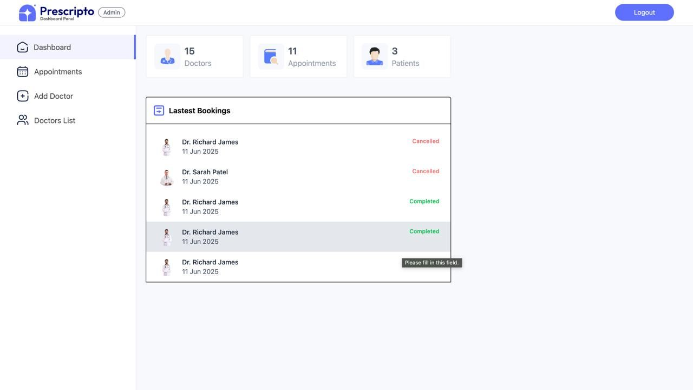
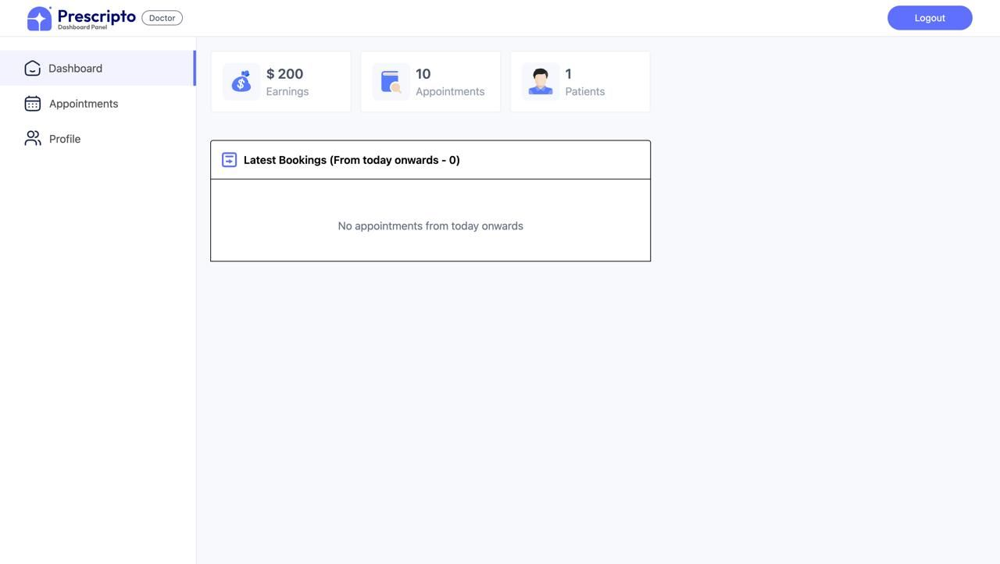

# 🩺 Prescripto – Doctor Appointment Booking System

Prescripto is a modern **MERN stack** (MongoDB, Express, React, Node.js) web application that allows patients to easily book appointments with doctors. It offers an intuitive admin panel, doctor dashboard, and user interface for smooth healthcare management.

---

## 🚀 Tech Stack

**Frontend:** React.js, Tailwind CSS  
**Backend:** Node.js, Express.js  
**Database:** MongoDB  
**Payment:** Stripe / Razorpay  
**Authentication:** JWT (JSON Web Token)

---

## ⚙️ Features

### 👩‍⚕️ For Patients
- Register and log in securely  
- Browse doctors by specialty  
- Book and manage appointments  
- Make online payments for consultations  

### 🧑‍⚕️ For Doctors
- Manage patient appointments  
- View schedules and availability  
- Update consultation status  

### 🧑‍💼 For Admin
- Manage users, doctors, and appointments  
- Approve or block doctor accounts  
- View complete system analytics  

---

## 🖼️ Screenshots

| Admin Panel | Dashboard | Doctor Panel |
|--------------|------------|---------------|
|  |  |  |

> 

---

## 🧩 Installation

1. **Clone the repository**
   ```bash
   git clone https://github.com/Iqbalcs/Final-year-project.git
   cd Final-year-project
Install dependencies

cd backend
npm install
cd ../frontend
npm install


Create an .env file inside the backend folder:

MONGO_URI=your_mongodb_connection_string
JWT_SECRET=your_secret_key
PORT=5000


Run the app

# In backend
npm start

# In frontend
npm run dev

## 📦 Folder Structure
Final-year-project/<br>
│<br>
├── backend/<br>
│   ├── config/<br>
│   ├── controllers/<br>
│   ├── models/<br>
│   ├── routes/<br>
│   ├── middlewares/<br>
│   ├── server.js<br>
│   ├── package.json<br>
│   └── .env<br>
│<br>
├── frontend/<br>
│   ├── src/<br>
│   ├── public/<br>
│   └── package.json<br>
│
└── screenshots/<br>
    ├── admin.jpeg<br>
    ├── dashboard.jpeg<br>
    └── Doctor.jpeg<br>

💬 Author<br>

Iqbal Hussain<br>
💻 MERN Stack Developer<br>
🌐 GitHub Profile<br>
=======<br>


